# Mini-Project: Sorting Algorithms

---

**University:** USTHB - Faculty of Computer Science
**Module:** Advanced Algorithms and Complexity - Master 1 IL
**Student:** Badla Moussaab - 212135027684
**Academic Year:** 2025-2026

---

## Table of Contents

1. [Introduction](#1-introduction)
2. [Experimental Environment](#2-experimental-environment)
3. [Sorting Algorithms](#3-sorting-algorithms)
   - 3.1 [Bubble Sort](#31-bubble-sort)
   - 3.2 [Bubble Sort Optimized](#32-bubble-sort-optimized)
   - 3.3 [Gnome Sort](#33-gnome-sort)
   - 3.4 [Quick Sort](#34-quick-sort)
   - 3.5 [Heap Sort](#35-heap-sort)
   - 3.6 [Radix Sort](#36-radix-sort)
   - 3.7 [Bucket Sort](#37-bucket-sort)
4. [Complexity Summary](#4-complexity-summary)
5. [Comparative Analysis](#5-comparative-analysis)
6. [Conclusion](#6-conclusion)

---

## 1. Introduction

Sorting is one of the most fundamental operations in computer science. The choice of sorting algorithm can significantly impact application performance, especially with large datasets.

This project implements and analyzes **seven sorting algorithms**:

- **Quadratic algorithms:** Bubble Sort, Bubble Sort Optimized, Gnome Sort
- **Efficient algorithms:** Quick Sort, Heap Sort, Radix Sort, Bucket Sort

### Objectives

1. Implement each algorithm in C following the provided specifications
2. Analyze theoretical time and space complexity
3. Conduct experimental benchmarks to validate theoretical analysis
4. Compare algorithm performance across different input scenarios

---

## 2. Experimental Environment

### Hardware & Software
- **Machine:** MacBook Air (M2, 2022)
- **Processor:** Apple M2 (8-core CPU, ARM64 architecture)
- **Memory:** 16 GB RAM
- **OS:** macOS Darwin 24.0.0
- **Language:** C with GCC compiler (-O2 optimization)
- **Timing:** `clock()` function from `<time.h>`

### Testing Methodology
- **Runs per test:** 5 (averaged for reliability)
- **Array sizes:** 100, 500, 1000, 5000, 10000
- **Test cases:**
  - **Random:** Uniformly distributed random values
  - **Best Case:** Pre-sorted array (ascending)
  - **Worst Case:** Reverse-sorted array (descending)

---

## 3. Sorting Algorithms

### 3.1 Bubble Sort

#### Principle
Bubble Sort repeatedly traverses the array, comparing adjacent elements and swapping them if they are in wrong order. Larger elements "bubble up" toward the end with each pass.

#### Pseudocode
```
BUBBLE-SORT(A, n)
    for i = 0 to n-2
        for j = 0 to n-i-2
            if A[j] > A[j+1]
                swap(A[j], A[j+1])
```

#### Implementation
```c
double bubbleSort(long size, int a[]) {
    clock_t start, end;
    start = clock();

    for (long i = 0; i < size - 1; i++) {
        for (long j = 0; j < size - i - 1; j++) {
            if (a[j] > a[j + 1]) {
                int temp = a[j];
                a[j] = a[j + 1];
                a[j + 1] = temp;
            }
        }
    }

    end = clock();
    return (double)(end - start) / CLOCKS_PER_SEC;
}
```

#### Complexity
| Case | Time | Space |
|------|------|-------|
| Best | O(n²) | O(1) |
| Average | O(n²) | O(1) |
| Worst | O(n²) | O(1) |

#### Experimental Results
| Size | Random (s) | Best (s) | Worst (s) |
|------|------------|----------|-----------|
| 100 | 0.000035 | 0.000002 | 0.000023 |
| 500 | 0.000669 | 0.000002 | 0.000242 |
| 1,000 | 0.001075 | 0.000001 | 0.000696 |
| 5,000 | 0.018547 | 0.000003 | 0.013448 |
| 10,000 | 0.074355 | 0.000006 | 0.053064 |

#### Performance Graph
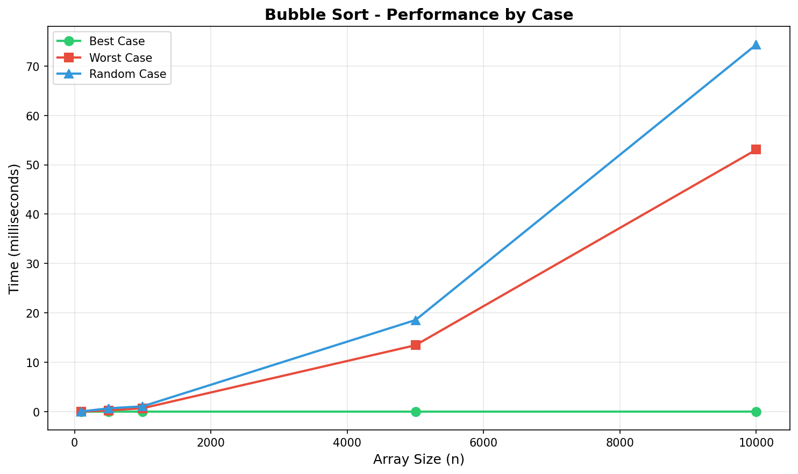

---

### 3.2 Bubble Sort Optimized

#### Principle
Adds a flag to detect if any swaps occurred during a pass. If no swaps happen, the array is already sorted and we can terminate early.

#### Pseudocode
```
BUBBLE-SORT-OPT(A, n)
    for i = 0 to n-2
        swapped = false
        for j = 0 to n-i-2
            if A[j] > A[j+1]
                swap(A[j], A[j+1])
                swapped = true
        if not swapped
            break
```

#### Implementation
```c
double bubbleSortOptimized(long size, int a[]) {
    clock_t start, end;
    start = clock();

    for (long i = 0; i < size - 1; i++) {
        bool swapped = false;
        for (long j = 0; j < size - i - 1; j++) {
            if (a[j] > a[j + 1]) {
                int temp = a[j];
                a[j] = a[j + 1];
                a[j + 1] = temp;
                swapped = true;
            }
        }
        if (!swapped) break;
    }

    end = clock();
    return (double)(end - start) / CLOCKS_PER_SEC;
}
```

#### Complexity
| Case | Time | Space |
|------|------|-------|
| Best | O(n) | O(1) |
| Average | O(n²) | O(1) |
| Worst | O(n²) | O(1) |

#### Experimental Results
| Size | Random (s) | Best (s) | Worst (s) |
|------|------------|----------|-----------|
| 100 | 0.000027 | 0.000002 | 0.000015 |
| 500 | 0.000462 | 0.000001 | 0.000153 |
| 1,000 | 0.000883 | 0.000002 | 0.000446 |
| 5,000 | 0.011456 | 0.000005 | 0.008305 |
| 10,000 | 0.046024 | 0.000009 | 0.032936 |

**Observation:** ~38% faster than standard Bubble Sort on random data. Best case confirms O(n) with early termination.

#### Performance Graph
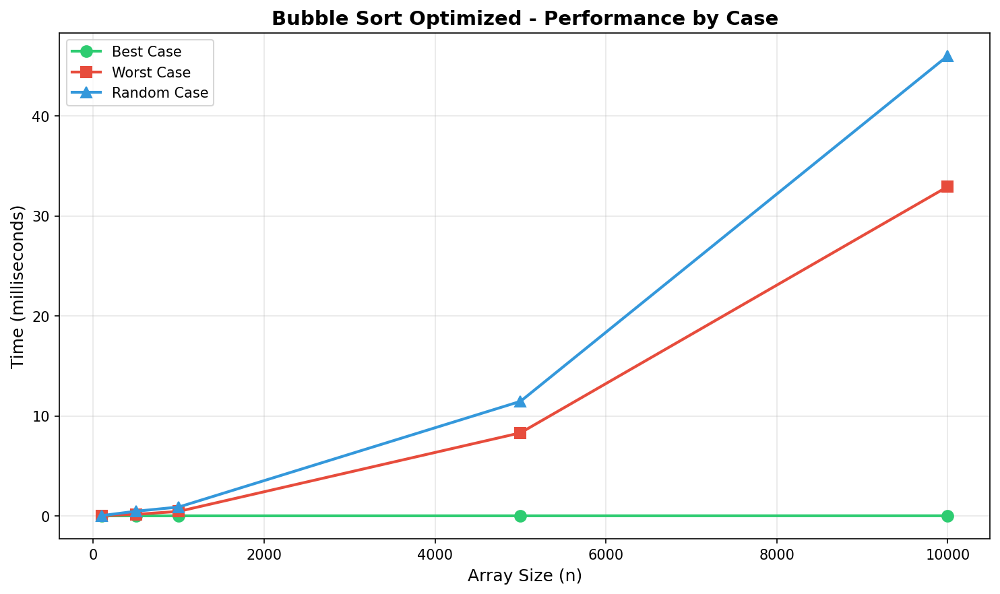

---

### 3.3 Gnome Sort

#### Principle
Also called "Stupid Sort" - works like a gnome sorting flower pots. Compare current element with previous: if in order, move forward; otherwise swap and move backward.

#### Pseudocode
```
GNOME-SORT(A, n)
    i = 0
    while i < n
        if i == 0 or A[i] >= A[i-1]
            i = i + 1
        else
            swap(A[i], A[i-1])
            i = i - 1
```

#### Implementation
```c
double gnomeSort(long size, int a[]) {
    clock_t start, end;
    start = clock();

    long i = 0;
    while (i < size) {
        if (i == 0 || a[i] >= a[i - 1]) {
            i++;
        } else {
            int temp = a[i];
            a[i] = a[i - 1];
            a[i - 1] = temp;
            i--;
        }
    }

    end = clock();
    return (double)(end - start) / CLOCKS_PER_SEC;
}
```

#### Complexity
| Case | Time | Space |
|------|------|-------|
| Best | O(n) | O(1) |
| Average | O(n²) | O(1) |
| Worst | O(n²) | O(1) |

#### Experimental Results
| Size | Random (s) | Best (s) | Worst (s) |
|------|------------|----------|-----------|
| 100 | 0.000021 | 0.000002 | 0.000044 |
| 500 | 0.000362 | 0.000001 | 0.000487 |
| 1,000 | 0.001231 | 0.000002 | 0.001745 |
| 5,000 | 0.019147 | 0.000004 | 0.038367 |
| 10,000 | 0.075316 | 0.000008 | 0.153107 |

**Observation:** Worst performance among all algorithms in worst case (0.153s at n=10,000) due to single-element backtracking.

#### Performance Graph
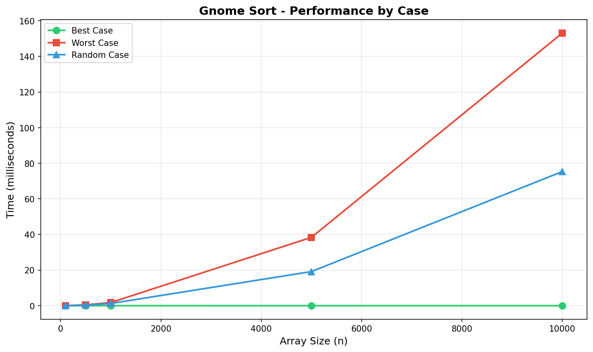

---

### 3.4 Quick Sort

#### Principle
Divide-and-conquer algorithm that selects a pivot and partitions the array so elements smaller than pivot go left, larger go right. Recursively sorts sub-arrays.

This implementation uses **Hoare's partition scheme** which is more efficient than Lomuto's.

#### Pseudocode
```
PARTITION(A, lo, hi)
    pivot = A[lo]
    i = lo - 1
    j = hi + 1
    while true
        do j = j - 1 while A[j] > pivot
        do i = i + 1 while A[i] < pivot
        if i >= j
            return j
        swap(A[i], A[j])

QUICK-SORT(A, p, r)
    if p < r
        q = PARTITION(A, p, r)
        QUICK-SORT(A, p, q)
        QUICK-SORT(A, q+1, r)
```

#### Implementation
```c
long partition(int a[], long d, long f) {
    int eltPivot = a[d];
    long i = d - 1;
    long j = f + 1;

    while (1) {
        do { j--; } while (a[j] > eltPivot);
        do { i++; } while (a[i] < eltPivot);

        if (i >= j) return j;

        int x = a[i];
        a[i] = a[j];
        a[j] = x;
    }
}

void quickSortRecursive(int a[], long p, long r) {
    if (p < r) {
        long q = partition(a, p, r);
        quickSortRecursive(a, p, q);
        quickSortRecursive(a, q + 1, r);
    }
}

double quickSort(long size, int a[]) {
    clock_t start, end;
    start = clock();
    quickSortRecursive(a, 0, size - 1);
    end = clock();
    return (double)(end - start) / CLOCKS_PER_SEC;
}
```

#### Complexity
| Case | Time | Space |
|------|------|-------|
| Best | O(n log n) | O(log n) |
| Average | O(n log n) | O(log n) |
| Worst | O(n²) | O(n) |

#### Experimental Results
| Size | Random (s) | Best (s) | Worst (s) |
|------|------------|----------|-----------|
| 100 | 0.000008 | 0.000013 | 0.000013 |
| 500 | 0.000036 | 0.000151 | 0.000106 |
| 1,000 | 0.000052 | 0.000514 | 0.000390 |
| 5,000 | 0.000245 | 0.010621 | 0.010646 |
| 10,000 | 0.000457 | 0.042899 | 0.042749 |

**Observation:** Excellent on random data (0.000457s) but degrades badly on sorted arrays (~0.043s) - a 94x difference! This is because first-element pivot causes maximum imbalance on sorted input.

#### Performance Graph
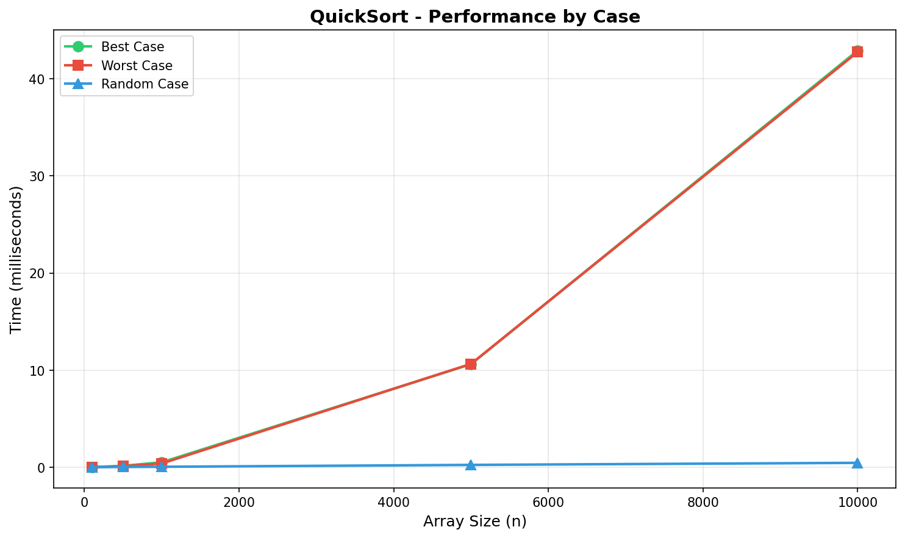

---

### 3.5 Heap Sort

#### Principle
Uses a binary max-heap structure. First builds a max-heap, then repeatedly extracts the maximum element and places it at the end.

#### Pseudocode
```
HEAPIFY(A, size, i)
    largest = i
    left = 2*i + 1
    right = 2*i + 2
    if left < size and A[left] > A[largest]
        largest = left
    if right < size and A[right] > A[largest]
        largest = right
    if largest != i
        swap(A[i], A[largest])
        HEAPIFY(A, size, largest)

HEAP-SORT(A, n)
    // Build max heap
    for i = n/2 - 1 down to 0
        HEAPIFY(A, n, i)
    // Extract elements
    for i = n-1 down to 0
        swap(A[0], A[i])
        HEAPIFY(A, i, 0)
```

#### Implementation
```c
void heapify(int a[], long size, long i) {
    long largest = i;
    long left = 2 * i + 1;
    long right = 2 * i + 2;

    if (left < size && a[left] > a[largest])
        largest = left;
    if (right < size && a[right] > a[largest])
        largest = right;

    if (largest != i) {
        int temp = a[i];
        a[i] = a[largest];
        a[largest] = temp;
        heapify(a, size, largest);
    }
}

double heapSort(long size, int a[]) {
    clock_t start, end;
    start = clock();

    for (long i = size / 2 - 1; i >= 0; i--)
        heapify(a, size, i);

    for (long i = size - 1; i >= 0; i--) {
        int temp = a[0];
        a[0] = a[i];
        a[i] = temp;
        heapify(a, i, 0);
    }

    end = clock();
    return (double)(end - start) / CLOCKS_PER_SEC;
}
```

#### Complexity
| Case | Time | Space |
|------|------|-------|
| Best | O(n log n) | O(1) |
| Average | O(n log n) | O(1) |
| Worst | O(n log n) | O(1) |

#### Experimental Results
| Size | Random (s) | Best (s) | Worst (s) |
|------|------------|----------|-----------|
| 100 | 0.000011 | 0.000016 | 0.000009 |
| 500 | 0.000050 | 0.000037 | 0.000029 |
| 1,000 | 0.000066 | 0.000061 | 0.000039 |
| 5,000 | 0.000303 | 0.000290 | 0.000258 |
| 10,000 | 0.000683 | 0.000619 | 0.000573 |

**Observation:** Most consistent algorithm - nearly identical times across all cases. Guaranteed O(n log n) regardless of input.

#### Performance Graph
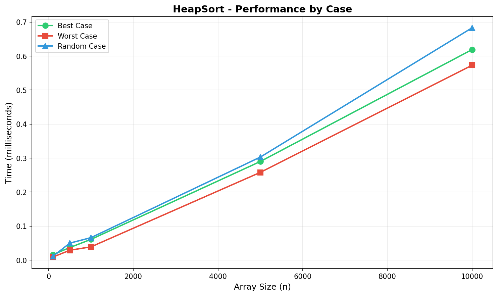

---

### 3.6 Radix Sort

#### Principle
Non-comparison sorting algorithm that processes integers digit by digit, from least significant to most significant digit, using counting sort as a stable subroutine.

#### Key Functions
- **key(x, i):** Extracts the i-th digit of number x
- **sortAux(A, n, i):** Counting sort based on digit i

#### Pseudocode
```
KEY(x, i)
    return (x / 10^i) mod 10

SORT-AUX(A, n, i)
    count[0..9] = 0
    for j = 0 to n-1
        count[KEY(A[j], i)]++
    for j = 1 to 9
        count[j] += count[j-1]
    for j = n-1 down to 0
        output[count[KEY(A[j], i)] - 1] = A[j]
        count[KEY(A[j], i)]--
    copy output to A

RADIX-SORT(A, n)
    d = number of digits in max(A)
    for i = 0 to d-1
        SORT-AUX(A, n, i)
```

#### Implementation
```c
int key(int x, int i) {
    int divisor = 1;
    for (int j = 0; j < i; j++)
        divisor *= 10;
    return (x / divisor) % 10;
}

void sortAux(int a[], long n, int i) {
    int *output = (int *)malloc(n * sizeof(int));
    int count[10] = {0};

    for (long j = 0; j < n; j++)
        count[key(a[j], i)]++;

    for (int j = 1; j < 10; j++)
        count[j] += count[j - 1];

    for (long j = n - 1; j >= 0; j--) {
        int digit = key(a[j], i);
        output[count[digit] - 1] = a[j];
        count[digit]--;
    }

    for (long j = 0; j < n; j++)
        a[j] = output[j];

    free(output);
}

double radixSort(long size, int a[]) {
    clock_t start, end;
    start = clock();

    int max = getMax(a, size);
    int k = 0, temp = max;
    while (temp > 0) { k++; temp /= 10; }
    if (k == 0) k = 1;

    for (int i = 0; i < k; i++)
        sortAux(a, size, i);

    end = clock();
    return (double)(end - start) / CLOCKS_PER_SEC;
}
```

#### Complexity
| Case | Time | Space |
|------|------|-------|
| Best | O(d×n) | O(n) |
| Average | O(d×n) | O(n) |
| Worst | O(d×n) | O(n) |

Where d = number of digits in the maximum value.

#### Experimental Results
| Size | Random (s) | Best (s) | Worst (s) |
|------|------------|----------|-----------|
| 100 | 0.000006 | 0.000006 | 0.000008 |
| 500 | 0.000016 | 0.000015 | 0.000013 |
| 1,000 | 0.000010 | 0.000015 | 0.000019 |
| 5,000 | 0.000037 | 0.000092 | 0.000093 |
| 10,000 | 0.000079 | 0.000184 | 0.000266 |

**Observation:** Fastest algorithm overall! With values ≤ 100, only 3 digits to process, resulting in near-linear performance.

#### Performance Graph
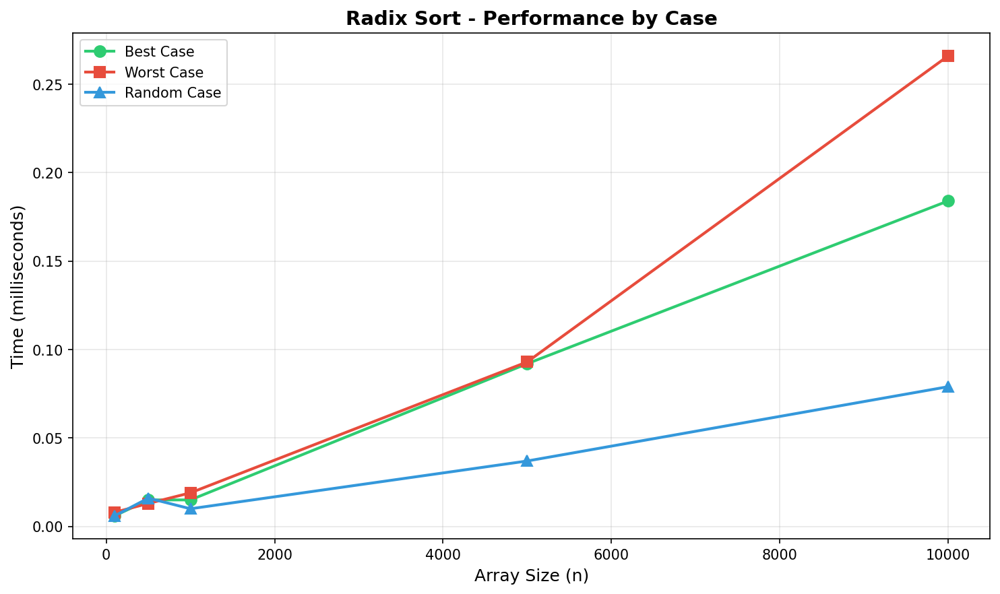

---

### 3.7 Bucket Sort

#### Principle
Distributes elements into buckets, sorts each bucket (using insertion sort), then concatenates results. Works best with uniformly distributed data in [0, 1).

#### Pseudocode
```
BUCKET-SORT(A, n)
    buckets[0..n-1] = empty lists
    for i = 0 to n-1
        index = floor(n * A[i])
        insert A[i] into buckets[index] in sorted order

    k = 0
    for i = 0 to n-1
        for each element in buckets[i]
            A[k++] = element
```

#### Implementation
```c
typedef struct Node {
    float value;
    struct Node *next;
} Node;

Node* insertSorted(Node *head, float value) {
    Node *newNode = (Node *)malloc(sizeof(Node));
    newNode->value = value;
    newNode->next = NULL;

    if (head == NULL || head->value >= value) {
        newNode->next = head;
        return newNode;
    }

    Node *current = head;
    while (current->next != NULL && current->next->value < value)
        current = current->next;

    newNode->next = current->next;
    current->next = newNode;
    return head;
}

double bucketSort(long size, float a[]) {
    clock_t start, end;
    start = clock();

    Node **buckets = (Node **)calloc(size, sizeof(Node *));

    for (long i = 0; i < size; i++) {
        int bucketIndex = (int)(size * a[i]);
        if (bucketIndex >= size) bucketIndex = size - 1;
        buckets[bucketIndex] = insertSorted(buckets[bucketIndex], a[i]);
    }

    long index = 0;
    for (long i = 0; i < size; i++) {
        Node *current = buckets[i];
        while (current != NULL) {
            a[index++] = current->value;
            current = current->next;
        }
        freeList(buckets[i]);
    }

    free(buckets);
    end = clock();
    return (double)(end - start) / CLOCKS_PER_SEC;
}
```

#### Complexity
| Case | Time | Space |
|------|------|-------|
| Best | O(n) | O(n) |
| Average | O(n) | O(n) |
| Worst | O(n²) | O(n) |

#### Experimental Results
| Size | Random (s) | Best (s) | Worst (s) |
|------|------------|----------|-----------|
| 100 | 0.000014 | 0.000011 | 0.000010 |
| 500 | 0.000043 | 0.000025 | 0.000024 |
| 1,000 | 0.000051 | 0.000025 | 0.000021 |
| 5,000 | 0.000218 | 0.000128 | 0.000127 |
| 10,000 | 0.000456 | 0.000243 | 0.000249 |

**Observation:** Excellent linear performance with uniform distribution. All cases perform similarly because bucket distribution depends on value distribution, not ordering.

#### Performance Graph
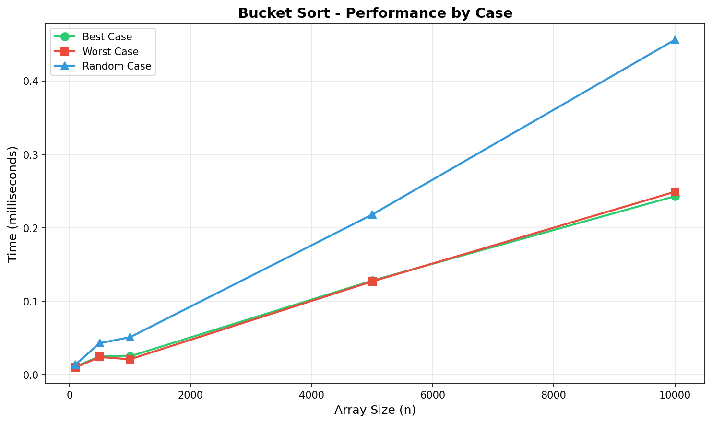

---

## 4. Complexity Summary

| Algorithm | Best | Average | Worst | Space | Stable |
|-----------|------|---------|-------|-------|--------|
| Bubble Sort | O(n²) | O(n²) | O(n²) | O(1) | Yes |
| Bubble Sort Opt | O(n) | O(n²) | O(n²) | O(1) | Yes |
| Gnome Sort | O(n) | O(n²) | O(n²) | O(1) | Yes |
| Quick Sort | O(n log n) | O(n log n) | O(n²) | O(log n) | No |
| Heap Sort | O(n log n) | O(n log n) | O(n log n) | O(1) | No |
| Radix Sort | O(d×n) | O(d×n) | O(d×n) | O(n) | Yes |
| Bucket Sort | O(n) | O(n) | O(n²) | O(n) | Yes |

---

## 5. Comparative Analysis

### 5.1 Worst Case Comparison

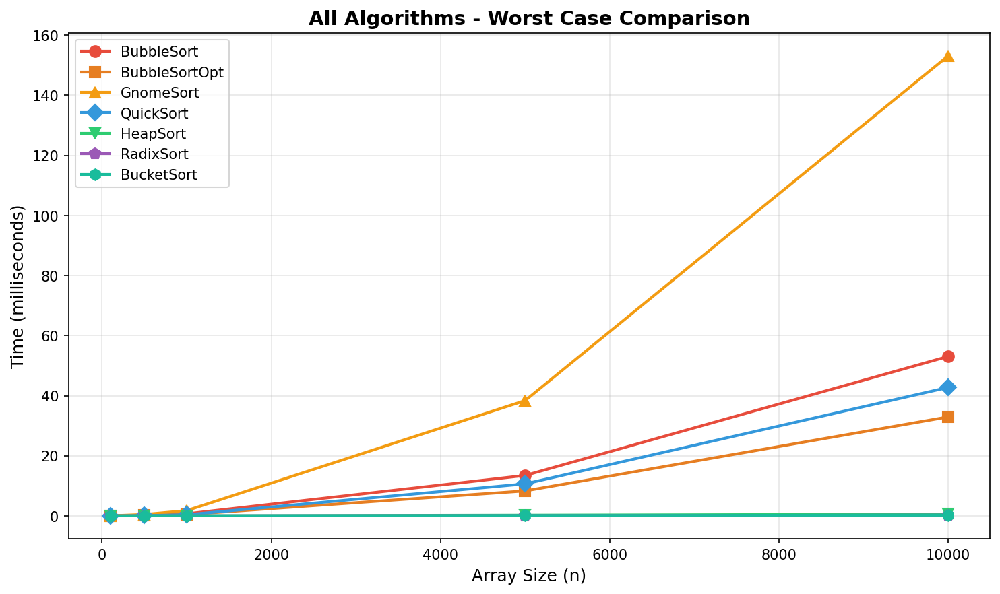

*Quadratic algorithms (Bubble, Gnome) show clear O(n²) growth while efficient algorithms stay fast.*

### 5.2 Random Case Comparison

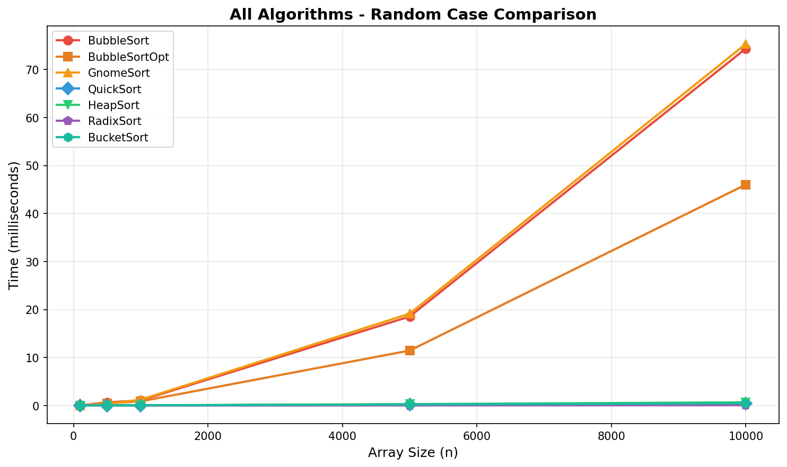

*Quick Sort performs excellently on random data, but quadratic algorithms struggle.*

### 5.3 Efficient Algorithms Only

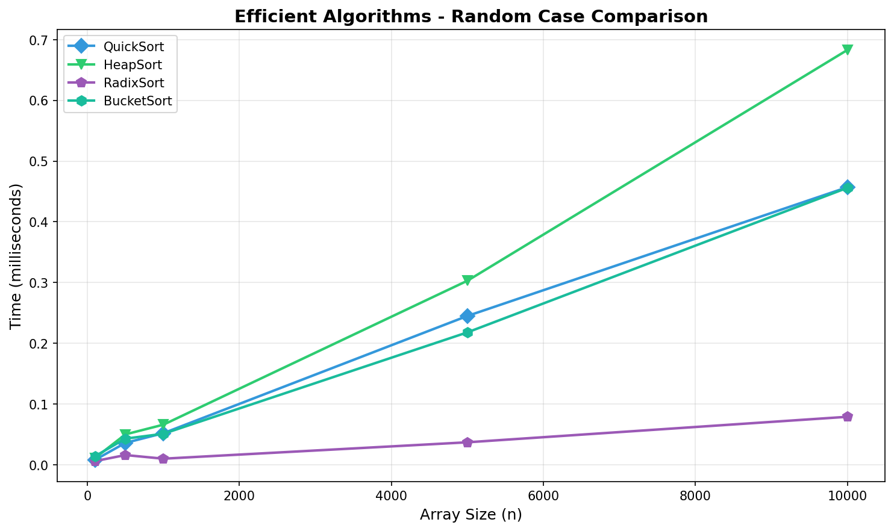

*Radix Sort is fastest, followed by Bucket Sort. Heap Sort is most consistent.*

### 5.4 Quadratic Algorithms Comparison

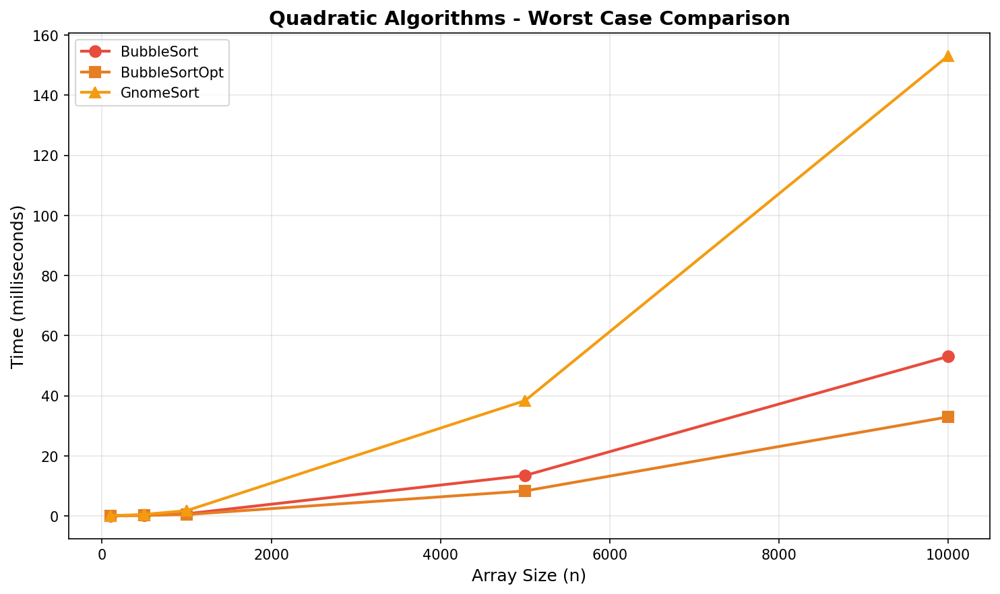

*Comparison of O(n²) algorithms. Gnome Sort is slowest in worst case, Bubble Sort Optimized is fastest.*

### 5.5 Bubble Sort: Classic vs Optimized

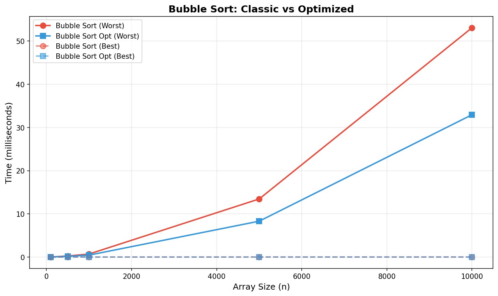

This graph directly compares the classic and optimized versions of Bubble Sort:
- **Worst Case:** Both perform similarly (O(n²))
- **Best Case:** Optimized version terminates in O(n) due to early exit when no swaps occur
- The optimization provides significant benefit only on nearly-sorted data

### 5.6 Logarithmic Scale

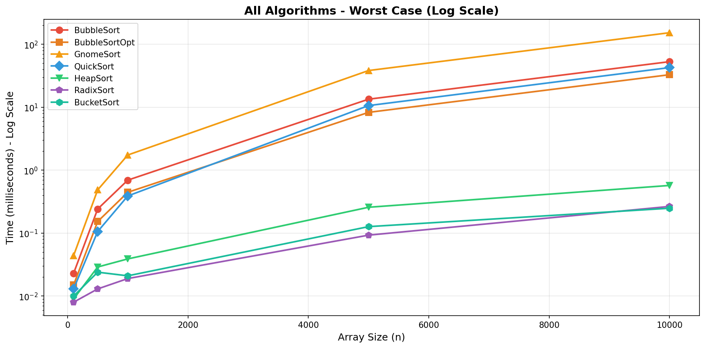

*Log scale shows ~100x performance gap between quadratic and efficient algorithms at n=10,000.*

### 5.7 Bar Chart Comparison at n=10,000

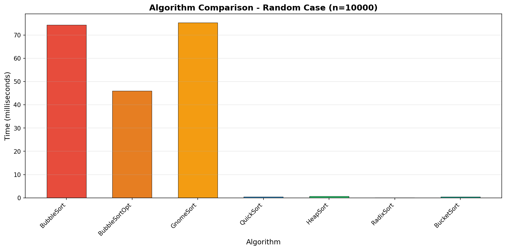

*Visual comparison showing the dramatic difference between algorithm families.*

### 5.8 Performance at n=10,000

| Algorithm | Time (ms) | Relative Speed |
|-----------|-----------|----------------|
| Radix Sort | 0.079 | 1x (fastest) |
| Bucket Sort | 0.456 | 5.8x |
| Quick Sort | 0.457 | 5.8x |
| Heap Sort | 0.683 | 8.6x |
| Bubble Sort Opt | 46.024 | 583x |
| Bubble Sort | 74.355 | 941x |
| Gnome Sort | 75.316 | 953x |

### 5.9 Efficiency Ranking

Based on our experimental results with random data at n=10,000, the algorithms rank as follows:

**Tier 1 - Very Fast (< 0.5 ms):**
1. **Radix Sort** - 0.079 ms - Best for bounded integers
2. **Bucket Sort** - 0.456 ms - Excellent for uniform distribution
3. **Quick Sort** - 0.457 ms - Great for random data

**Tier 2 - Fast (< 1 ms):**
4. **Heap Sort** - 0.683 ms - Most consistent, guaranteed O(n log n)

**Tier 3 - Slow (> 40 ms):**
5. **Bubble Sort Opt** - 46.024 ms - Better than classic on sorted data
6. **Bubble Sort** - 74.355 ms - Simple but impractical for large n
7. **Gnome Sort** - 75.316 ms - Worst overall performance

### 5.10 Key Observations

1. **Quadratic algorithms don't scale** - At n=10,000, they are ~100-1000x slower than efficient ones

2. **Radix Sort is fastest** for bounded integers due to linear O(d×n) complexity

3. **Heap Sort is most reliable** - consistent O(n log n) in ALL cases

4. **Quick Sort has a weakness** - degrades to O(n²) on sorted input with first-element pivot

5. **Bucket Sort needs uniform distribution** - excellent O(n) when data is uniformly distributed

---

## 6. Conclusion

### Summary

| For this use case... | Best algorithm |
|---------------------|----------------|
| General purpose | Heap Sort |
| Random integers (bounded) | Radix Sort |
| Uniform floats in [0,1) | Bucket Sort |
| Nearly sorted data | Bubble Sort Optimized |
| Memory constrained | Heap Sort (O(1) space) |
| Small arrays (n < 100) | Any works fine |

### Key Takeaways

1. **No single "best" algorithm** - choice depends on data characteristics

2. **Avoid quadratic algorithms** for large datasets - they become impractical

3. **Heap Sort provides guarantees** - when you need predictable worst-case performance

4. **Distribution-based sorts beat O(n log n)** when input has exploitable structure

5. **Theoretical complexity matches experiments** - our benchmarks confirm the theory

