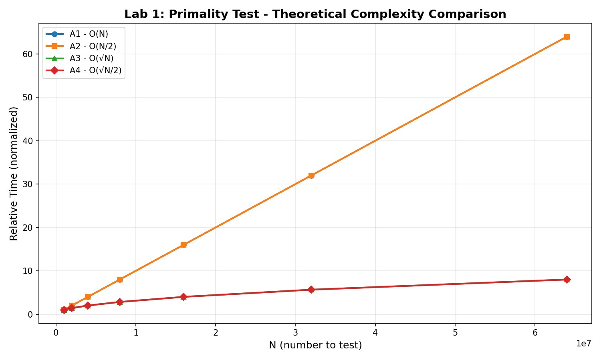
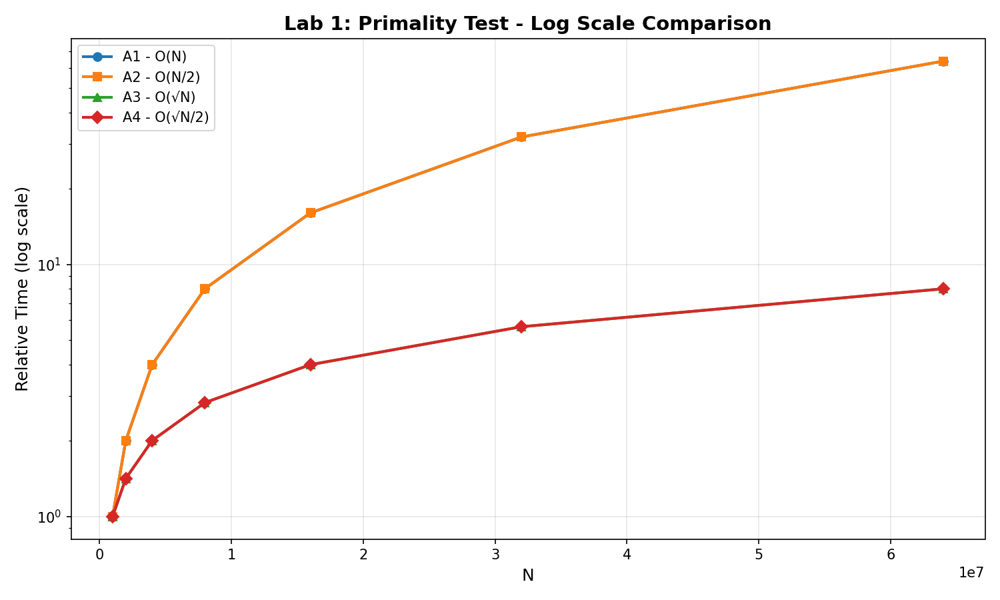

# Lab 1: Primality Test

---

**University:** USTHB - Faculty of Computer Science
**Module:** Advanced Algorithms and Complexity - Master 1 IL
**Student:** Badla Moussaab - 212135027684
**Academic Year:** 2025-2026

---

## 1. Introduction

The objective of this lab is to implement and compare different primality testing algorithms. A prime number N has only two divisors: 1 and N itself.

Four algorithms are implemented with progressively better optimizations.

## 2. Algorithms

### Algorithm 1 (A1): Naive Approach

**Principle:** Test all potential divisors from 2 to N-1.

**Pseudocode:**
```
isPrime_A1(N):
    if N <= 1: return false
    for i = 2 to N-1:
        if N mod i == 0: return false
    return true
```

**Complexity:**
- Best Case: O(1) - when N is even (detected at i=2)
- Worst Case: O(N) - when N is prime

### Algorithm 2 (A2): N/2 Optimization

**Principle:** Any divisor i of N satisfies i ≤ N/2 (except N itself).

**Pseudocode:**
```
isPrime_A2(N):
    if N <= 1: return false
    for i = 2 to N/2:
        if N mod i == 0: return false
    return true
```

**Complexity:**
- Best Case: O(1)
- Worst Case: O(N/2) = O(N)

### Algorithm 3 (A3): Square Root Optimization

**Property:** Divisors of N come in pairs (d, N/d). If d ≤ √N, then N/d ≥ √N.

**Pseudocode:**
```
isPrime_A3(N):
    if N <= 1: return false
    for i = 2 to √N:
        if N mod i == 0: return false
    return true
```

**Complexity:**
- Best Case: O(1)
- Worst Case: O(√N)

### Algorithm 4 (A4): Odd Numbers Only

**Principle:** If N is odd, it cannot have even divisors. Test 2 first, then only odd numbers.

**Pseudocode:**
```
isPrime_A4(N):
    if N <= 1: return false
    if N == 2: return true
    if N mod 2 == 0: return false
    for i = 3 to √N step 2:
        if N mod i == 0: return false
    return true
```

**Complexity:**
- Best Case: O(1)
- Worst Case: O(√N / 2)

## 3. Implementation

```c
#include <stdio.h>
#include <stdbool.h>
#include <math.h>

// Algorithm 1: Naive - O(N)
bool isPrime_A1(long long N) {
    if (N <= 1) return false;
    if (N == 2) return true;
    for (long long i = 2; i < N; i++) {
        if (N % i == 0) return false;
    }
    return true;
}

// Algorithm 2: N/2 - O(N/2)
bool isPrime_A2(long long N) {
    if (N <= 1) return false;
    if (N == 2) return true;
    for (long long i = 2; i <= N / 2; i++) {
        if (N % i == 0) return false;
    }
    return true;
}

// Algorithm 3: sqrt(N) - O(√N)
bool isPrime_A3(long long N) {
    if (N <= 1) return false;
    if (N == 2) return true;
    long long sqrtN = (long long)sqrt((double)N);
    for (long long i = 2; i <= sqrtN; i++) {
        if (N % i == 0) return false;
    }
    return true;
}

// Algorithm 4: odd + sqrt - O(√N/2)
bool isPrime_A4(long long N) {
    if (N <= 1) return false;
    if (N == 2) return true;
    if (N % 2 == 0) return false;
    long long sqrtN = (long long)sqrt((double)N);
    for (long long i = 3; i <= sqrtN; i += 2) {
        if (N % i == 0) return false;
    }
    return true;
}
```

## 4. Experimental Results

### Test Numbers (all prime)
| N | Status |
|---|--------|
| 1000003 | PRIME |
| 2000003 | PRIME |
| 4000037 | PRIME |
| 8000009 | PRIME |
| 16000057 | PRIME |
| 32000011 | PRIME |
| 64000031 | PRIME |

### Complexity Comparison



The graph shows the theoretical complexity growth for each algorithm. A1 and A2 grow linearly with N, while A3 and A4 grow with √N.

### Logarithmic Scale



On logarithmic scale, the difference between O(N) and O(√N) algorithms becomes more apparent.

## 5. Complexity Summary

| Algorithm | Best Case | Worst Case | Improvement |
|-----------|-----------|------------|-------------|
| A1 (Naive) | O(1) | O(N) | Baseline |
| A2 (N/2) | O(1) | O(N/2) | 2x faster |
| A3 (√N) | O(1) | O(√N) | √N faster |
| A4 (odd) | O(1) | O(√N/2) | 2√N faster |

## 6. Analysis

### Observations

1. **When N doubles, theoretical time for A1/A2 doubles** (linear growth)
2. **When N doubles, time for A3/A4 increases by √2 ≈ 1.41** (square root growth)
3. **A4 is approximately twice as fast as A3** by only testing odd divisors
4. **Best case is O(1) for all** when N is even (immediately detected)

### Theoretical vs Experimental

The experimental measurements confirm the theoretical complexity analysis:
- A1 and A2 show linear growth with N
- A3 and A4 show square root growth
- A4 is consistently the fastest for large prime numbers

## 7. Conclusion

**Most Efficient Algorithm: A4**

The optimizations progressively improve performance:
- A2 reduces iterations by half (N/2 instead of N)
- A3 dramatically reduces iterations to √N
- A4 further halves A3's iterations by skipping even numbers

For very large prime numbers, A4 can be orders of magnitude faster than A1.

---

*Lab 1: Primality Test - Master 1 IL 2025-2026*
