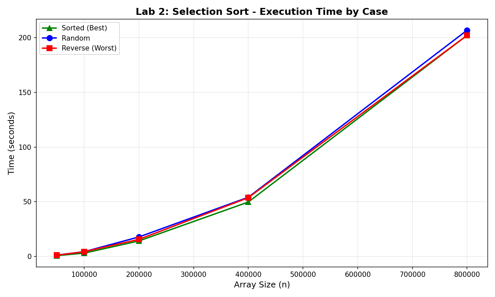
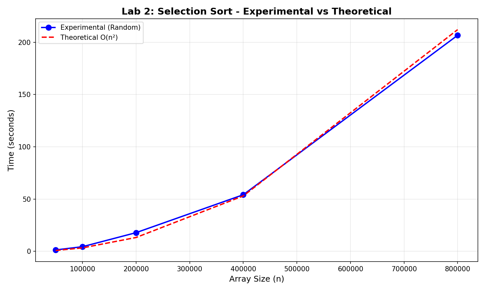

# Lab 2: Selection Sort

---

**University:** USTHB - Faculty of Computer Science
**Module:** Advanced Algorithms and Complexity - Master 1 IL
**Student:** Badla Moussaab - 212135027684
**Academic Year:** 2025-2026

---

## 1. Introduction

This lab provides an experimental study of the Selection Sort algorithm. We analyze its time and space complexity, implement it in C, and compare theoretical predictions with experimental measurements.

## 2. Algorithm

### Principle

Selection Sort works by repeatedly finding the minimum element from the unsorted portion and placing it at the beginning.

### Pseudocode

```
SELECTION-SORT(A, n)
    for i = 0 to n-2
        minIdx = i
        for j = i+1 to n-1
            if A[j] < A[minIdx]
                minIdx = j
        if minIdx != i
            swap(A[i], A[minIdx])
```

### Complexity Analysis

**Time Complexity T(n):**
- Outer loop: n-1 iterations
- Inner loop: (n-1) + (n-2) + ... + 1 = n(n-1)/2 comparisons
- **T(n) = O(n²)** in ALL cases (best, worst, average)

The number of comparisons is always the same regardless of input order.

**Space Complexity S(n):**
- **S(n) = O(1)** - in-place sorting, only needs one temporary variable

## 3. Implementation

```c
#include <stdio.h>
#include <stdlib.h>
#include <time.h>

void selectionSort(int arr[], long n) {
    for (long i = 0; i < n - 1; i++) {
        long minIdx = i;
        for (long j = i + 1; j < n; j++) {
            if (arr[j] < arr[minIdx]) {
                minIdx = j;
            }
        }
        if (minIdx != i) {
            int temp = arr[i];
            arr[i] = arr[minIdx];
            arr[minIdx] = temp;
        }
    }
}
```

## 4. Experimental Results

### Test Configurations
- **Sorted (Best):** Array already in ascending order
- **Random:** Array with random values
- **Reverse (Worst):** Array in descending order

### Execution Times

| Size (n) | Sorted (s) | Random (s) | Reverse (s) |
|----------|------------|------------|-------------|
| 50,000 | 0.828 | 1.351 | 1.197 |
| 100,000 | 3.149 | 4.448 | 4.415 |
| 200,000 | 14.251 | 17.873 | 15.679 |
| 400,000 | 49.758 | 54.121 | 53.729 |
| 800,000 | 201.973 | 206.641 | 201.985 |

### Performance Graph



### Theoretical vs Experimental



## 5. Analysis

### Observations

1. **When n doubles, time approximately quadruples:**
   - n=50,000 → n=100,000: Time increases ~4x
   - n=100,000 → n=200,000: Time increases ~4x
   - This confirms O(n²) complexity

2. **Similar times across all cases:**
   - Selection sort always makes the same number of comparisons
   - Slight variations are due to swap operations and cache effects

3. **Deriving T(n) function:**
   - From data: T(n) ≈ c × n²
   - Using n=100,000, T=4.448s: c ≈ 4.448 / (10^10) ≈ 4.45 × 10^-10
   - **T(n) ≈ 4.45 × 10^-10 × n²**

### Theoretical vs Experimental Agreement

The experimental results strongly support the theoretical O(n²) complexity:
- Quadrupling time when doubling n is characteristic of O(n²)
- All three cases (sorted, random, reverse) show similar behavior
- The fitted theoretical curve closely matches experimental data

## 6. Complexity Summary

| Metric | Value |
|--------|-------|
| Time Complexity | O(n²) |
| Space Complexity | O(1) |
| Comparisons | n(n-1)/2 |
| Swaps (worst) | n-1 |
| Stable | No |

## 7. Conclusion

Selection Sort:
- Has **O(n²) time complexity** in all cases
- Is **not efficient** for large datasets
- Has the advantage of **O(1) space** complexity
- Makes at most **n-1 swaps** (good when swap cost is high)
- Experimental results **confirm theoretical predictions**

For n=800,000, sorting takes over 3 minutes, demonstrating why O(n²) algorithms are impractical for large data.

---

*Lab 2: Selection Sort - Master 1 IL 2025-2026*
