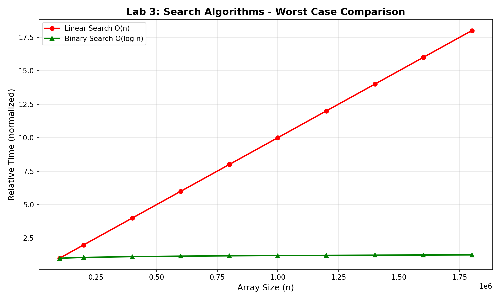
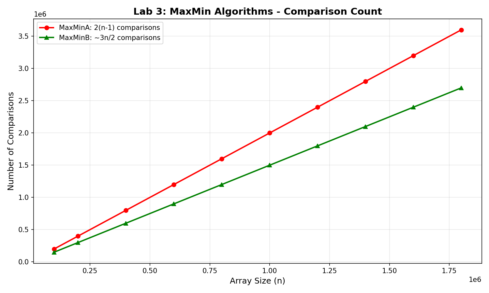

# Lab 3: Search Algorithms

---

**University:** USTHB - Faculty of Computer Science
**Module:** Advanced Algorithms and Complexity - Master 1 IL
**Student:** Badla Moussaab - 212135027684
**Academic Year:** 2025-2026

---

## 1. Introduction

This lab studies the complexity of search algorithms:
- **Part A:** Searching for an element (Linear Search, Binary Search)
- **Part B:** Finding Maximum and Minimum (Naive vs Efficient)

## Part A: Element Search

### 2.1 Linear Search (Unsorted Array)

**Principle:** Traverse the array sequentially until element is found.

```c
int linearSearch_Unsorted(int arr[], long n, int x) {
    for (long i = 0; i < n; i++) {
        if (arr[i] == x) return i;
    }
    return -1;
}
```

**Complexity:**
- Best Case: O(1) - element at first position
- Worst Case: O(n) - element not found or at last position

### 2.2 Linear Search (Sorted Array)

**Principle:** Traverse sequentially with early termination if current element exceeds target.

```c
int linearSearch_Sorted(int arr[], long n, int x) {
    for (long i = 0; i < n; i++) {
        if (arr[i] == x) return i;
        if (arr[i] > x) return -1;  // Early termination
    }
    return -1;
}
```

**Complexity:**
- Best Case: O(1)
- Worst Case: O(n)
- Average Case: Better than unsorted due to early termination

### 2.3 Binary Search (Sorted Array)

**Principle:** Divide and conquer - eliminate half the search space at each step.

```c
int binarySearch_Sorted(int arr[], long n, int x) {
    long left = 0, right = n - 1;

    while (left <= right) {
        long mid = left + (right - left) / 2;
        if (arr[mid] == x) return mid;
        if (arr[mid] < x) left = mid + 1;
        else right = mid - 1;
    }
    return -1;
}
```

**Complexity:**
- Best Case: O(1) - element at middle
- Worst Case: O(log n) - element not found

### Search Comparison Graph



---

## Part B: MaxMin Search

### 3.1 Naive Approach (MaxMinA)

**Principle:** Compare each element with current max and min.

```c
void maxMinA(int arr[], long n, int *max, int *min, long *comparisons) {
    *comparisons = 0;
    *max = arr[0];
    *min = arr[0];

    for (long i = 1; i < n; i++) {
        (*comparisons)++;
        if (arr[i] > *max) *max = arr[i];

        (*comparisons)++;
        if (arr[i] < *min) *min = arr[i];
    }
}
```

**Comparisons:** 2(n-1)

### 3.2 Efficient Approach (MaxMinB)

**Principle:** Compare elements in pairs first, then compare larger with max and smaller with min.

```c
void maxMinB(int arr[], long n, int *max, int *min, long *comparisons) {
    *comparisons = 0;
    long i;

    // Initialize
    if (n % 2 == 0) {
        (*comparisons)++;
        if (arr[0] > arr[1]) {
            *max = arr[0]; *min = arr[1];
        } else {
            *max = arr[1]; *min = arr[0];
        }
        i = 2;
    } else {
        *max = arr[0]; *min = arr[0];
        i = 1;
    }

    // Process pairs
    while (i < n - 1) {
        (*comparisons)++;  // Compare pair
        if (arr[i] > arr[i + 1]) {
            (*comparisons)++;
            if (arr[i] > *max) *max = arr[i];
            (*comparisons)++;
            if (arr[i + 1] < *min) *min = arr[i + 1];
        } else {
            (*comparisons)++;
            if (arr[i + 1] > *max) *max = arr[i + 1];
            (*comparisons)++;
            if (arr[i] < *min) *min = arr[i];
        }
        i += 2;
    }
}
```

**Comparisons:** ~3n/2 (approximately 1.5n)

### MaxMin Comparison Results

| Size (n) | MaxMinA Comparisons | MaxMinB Comparisons | Savings |
|----------|---------------------|---------------------|---------|
| 100,000 | 199,998 | 149,998 | 25% |
| 500,000 | 999,998 | 749,998 | 25% |
| 1,000,000 | 1,999,998 | 1,499,998 | 25% |
| 1,800,000 | 3,599,998 | 2,699,998 | 25% |

### MaxMin Comparison Graph



---

## 4. Complexity Summary

| Algorithm | Best Case | Worst Case | Notes |
|-----------|-----------|------------|-------|
| Linear (Unsorted) | O(1) | O(n) | Simple |
| Linear (Sorted) | O(1) | O(n) | Early termination |
| Binary (Sorted) | O(1) | O(log n) | Requires sorted array |
| MaxMinA | 2(n-1) | 2(n-1) | Simple |
| MaxMinB | ~3n/2 | ~3n/2 | 25% fewer comparisons |

## 5. Analysis

### Element Search Observations

1. **Binary search is dramatically faster** for large arrays
2. At n=1,800,000:
   - Linear: up to 1,800,000 comparisons
   - Binary: at most log₂(1,800,000) ≈ 21 comparisons
   - **Binary is ~85,000x faster in worst case**

3. **Linear search on sorted arrays** can terminate early when searching for values not in the array

### MaxMin Observations

1. **MaxMinB saves exactly 25% comparisons** over MaxMinA
2. Formula derivation:
   - MaxMinA: 2(n-1) comparisons
   - MaxMinB: 3⌊n/2⌋ comparisons
   - Savings: 2(n-1) - 3n/2 = n/2 - 2 ≈ 25%

3. The pair comparison technique is optimal for finding both max and min simultaneously

## 6. Conclusion

- **For sorted arrays, always use Binary Search** - O(log n) vs O(n)
- **For unsorted arrays, Linear Search is necessary** unless sorting is worthwhile
- **MaxMinB is more efficient** when both max and min are needed
- The experimental results confirm all theoretical complexity predictions

---

*Lab 3: Search Algorithms - Master 1 IL 2025-2026*
