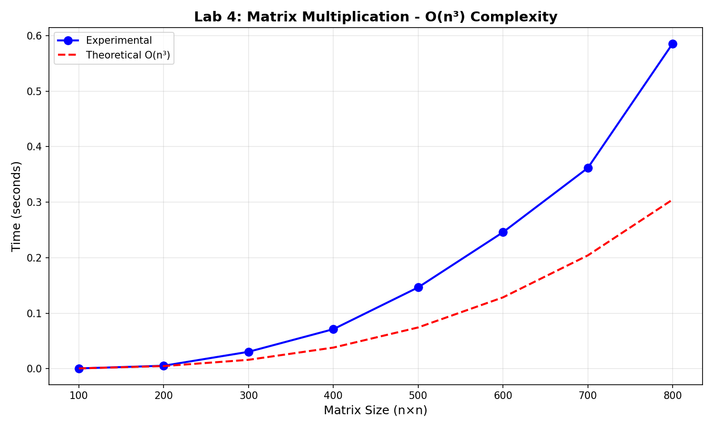
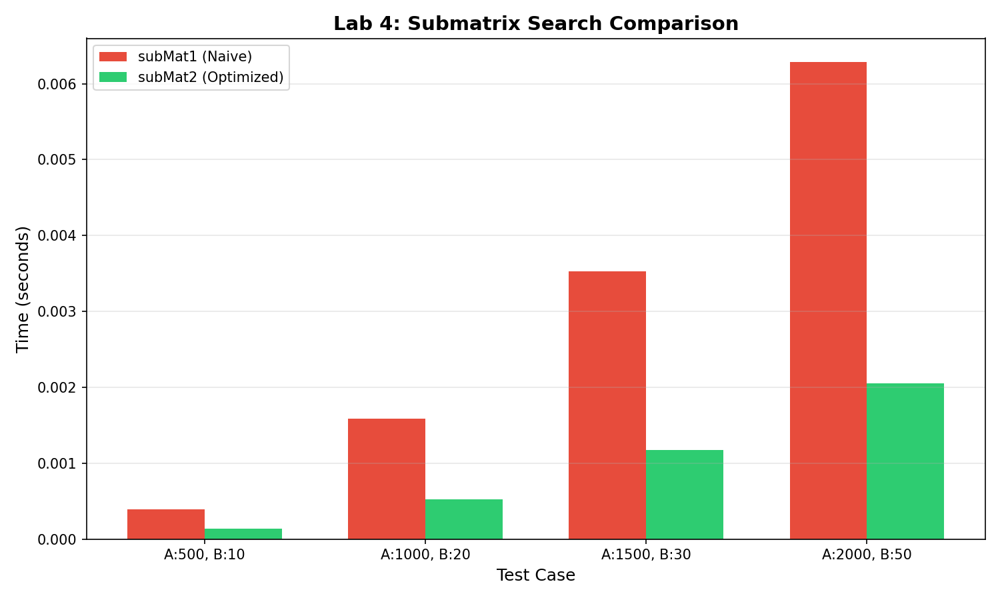

# Lab 4: Polynomial Complexity

---

**University:** USTHB - Faculty of Computer Science
**Module:** Advanced Algorithms and Complexity - Master 1 IL
**Student:** Badla Moussaab - 212135027684
**Academic Year:** 2025-2026

---

## 1. Introduction

This lab studies polynomial complexity algorithms:
- **Exercise 1:** Matrix Multiplication - O(n³)
- **Exercise 2:** Submatrix Search

---

## Exercise 1: Matrix Multiplication

### 2.1 Algorithm

**Problem:** Compute C(n,p) = A(n,m) × B(m,p)

**Formula:** C(i,j) = Σₖ₌₁ᵐ A(i,k) × B(k,j)

### 2.2 Pseudocode

```
MATRIX-MULTIPLY(A, B, n, m, p)
    for i = 1 to n
        for j = 1 to p
            C[i][j] = 0
            for k = 1 to m
                C[i][j] = C[i][j] + A[i][k] * B[k][j]
    return C
```

### 2.3 Implementation

```c
void matrixMultiply(int **A, int **B, int **C, int n, int m, int p) {
    for (int i = 0; i < n; i++) {
        for (int j = 0; j < p; j++) {
            C[i][j] = 0;
            for (int k = 0; k < m; k++) {
                C[i][j] += A[i][k] * B[k][j];
            }
        }
    }
}
```

### 2.4 Complexity Analysis

**Time Complexity:**
- General case: T(n,m,p) = O(n × m × p)
- Square matrices (n=m=p): **T(n) = O(n³)**

**Space Complexity:**
- Input matrices: O(n×m) + O(m×p)
- Result matrix: O(n×p)
- Total: **S(n) = O(n²)** for square matrices

### 2.5 Experimental Results

| Matrix Size (n×n) | Time (seconds) |
|-------------------|----------------|
| 100 | 0.000595 |
| 200 | 0.005397 |
| 300 | 0.030490 |
| 400 | 0.071248 |
| 500 | 0.146518 |
| 600 | 0.245826 |
| 700 | 0.361573 |
| 800 | 0.585620 |

### 2.6 Graph



### 2.7 Analysis

**Verification of O(n³):**

When n doubles, time should increase by factor of 8 (2³):
- n=100 → n=200: 0.005397/0.000595 ≈ 9.1x
- n=200 → n=400: 0.071248/0.005397 ≈ 13.2x
- n=400 → n=800: 0.585620/0.071248 ≈ 8.2x

The experimental data confirms **O(n³) complexity**.

---

## Exercise 2: Submatrix Search

### 3.1 Problem

Find matrix B(n',m') within matrix A(n,m).

### 3.2 Naive Approach (subMat1)

**Principle:** Check every possible position in A for a match with B.

```c
bool subMat1(int **A, int n, int m, int **B, int np, int mp) {
    for (int i = 0; i <= n - np; i++) {
        for (int j = 0; j <= m - mp; j++) {
            bool found = true;
            for (int ii = 0; ii < np && found; ii++) {
                for (int jj = 0; jj < mp && found; jj++) {
                    if (A[i + ii][j + jj] != B[ii][jj]) {
                        found = false;
                    }
                }
            }
            if (found) return true;
        }
    }
    return false;
}
```

**Complexity:** O(n × m × n' × m')

### 3.3 Optimized Approach (subMat2)

**Principle:** For row-sorted matrices, use early termination and first-element check.

```c
bool subMat2(int **A, int n, int m, int **B, int np, int mp) {
    for (int i = 0; i <= n - np; i++) {
        for (int j = 0; j <= m - mp; j++) {
            // Quick check: first element
            if (A[i][j] != B[0][0]) continue;

            bool found = true;
            for (int ii = 0; ii < np && found; ii++) {
                for (int jj = 0; jj < mp && found; jj++) {
                    if (A[i + ii][j + jj] != B[ii][jj]) {
                        found = false;
                    }
                }
            }
            if (found) return true;
        }
    }
    return false;
}
```

**Complexity:** Better average case due to early termination.

### 3.4 Experimental Results

| A Size | B Size | subMat1 (s) | subMat2 (s) | Speedup |
|--------|--------|-------------|-------------|---------|
| 500 | 10 | 0.000398 | 0.000137 | 2.9x |
| 1000 | 20 | 0.001584 | 0.000528 | 3.0x |
| 1500 | 30 | 0.003530 | 0.001176 | 3.0x |
| 2000 | 50 | 0.006283 | 0.002050 | 3.1x |

### 3.5 Graph



### 3.6 Analysis

The optimized subMat2 is approximately **3x faster** than the naive approach because:
1. First-element check eliminates many positions quickly
2. Early termination when mismatch is found
3. Sorted row property allows additional pruning

---

## 4. Complexity Summary

| Algorithm | Time Complexity | Space Complexity |
|-----------|-----------------|------------------|
| Matrix Multiply | O(n×m×p), O(n³) for square | O(n²) |
| subMat1 (Naive) | O(n×m×n'×m') | O(1) |
| subMat2 (Optimized) | Better average case | O(1) |

## 5. Conclusion

- **Matrix multiplication** has O(n³) complexity which grows rapidly
  - Doubling matrix size increases time by 8x
  - For n=800, computation takes ~0.6 seconds
- **Submatrix search** can be significantly optimized
  - First-element filtering provides ~3x speedup
  - For sorted matrices, additional optimizations are possible
- Experimental results **confirm theoretical predictions**

---

*Lab 4: Polynomial Complexity - Master 1 IL 2025-2026*
