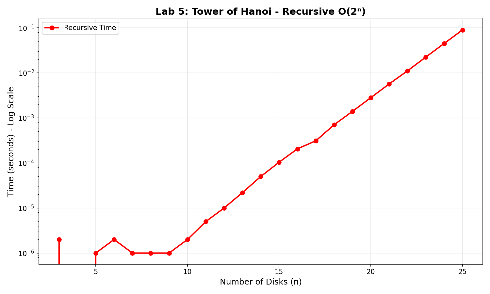
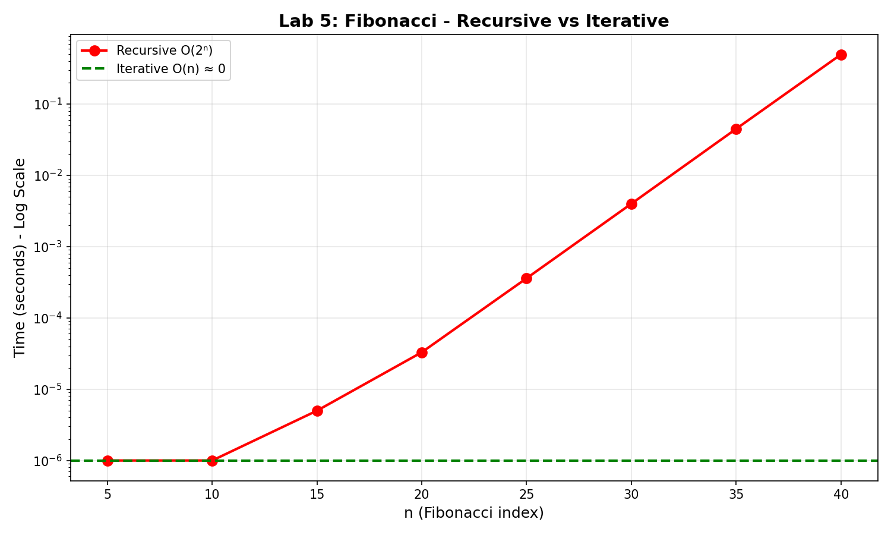
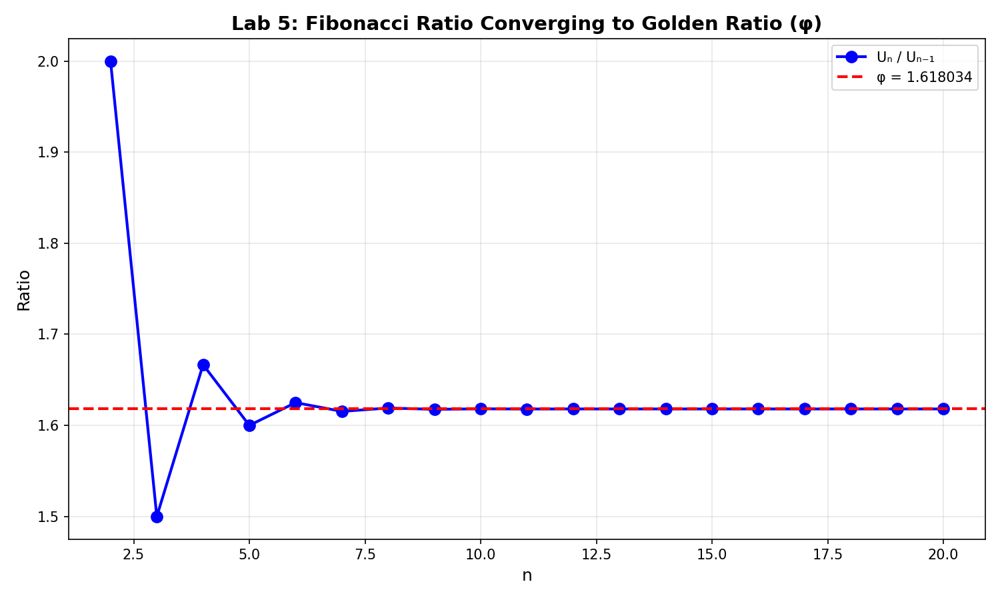

# Lab 5: Iterative vs Recursive Algorithms

---

**University:** USTHB - Faculty of Computer Science
**Module:** Advanced Algorithms and Complexity - Master 1 IL
**Student:** Badla Moussaab - 212135027684
**Academic Year:** 2025-2026

---

## 1. Introduction

This lab compares iterative and recursive approaches for two classic problems:
- **Exercise 1:** Tower of Hanoi
- **Exercise 2:** Fibonacci Sequence

---

## Exercise 1: Tower of Hanoi

### 2.1 Problem Description

Move n disks from source peg to destination peg using an auxiliary peg, following rules:
1. Move only one disk at a time
2. A larger disk cannot be placed on a smaller disk

### 2.2 Recursive Algorithm

```c
void hanoiRecursive(int n, char from, char to, char aux) {
    if (n == 1) {
        // Move disk 1 from 'from' to 'to'
        return;
    }
    hanoiRecursive(n - 1, from, aux, to);
    // Move disk n from 'from' to 'to'
    hanoiRecursive(n - 1, aux, to, from);
}
```

### 2.3 Complexity Analysis

**Recurrence Relation:** T(n) = 2T(n-1) + 1

**Solution:** T(n) = 2ⁿ - 1

**Time Complexity:** O(2ⁿ)
**Space Complexity:** O(n) - recursive call stack

### 2.4 Iterative Algorithm

The iterative version uses a different approach based on disk parity and peg positions.

**Time Complexity:** O(2ⁿ) - same number of moves
**Space Complexity:** O(1) - no recursion stack

### 2.5 Experimental Results

| n | Recursive (s) | Iterative (s) | Moves (2ⁿ-1) |
|---|---------------|---------------|--------------|
| 10 | 0.000002 | 0.000000 | 1,023 |
| 15 | 0.000104 | 0.000000 | 32,767 |
| 20 | 0.002814 | 0.000000 | 1,048,575 |
| 22 | 0.011086 | 0.000001 | 4,194,303 |
| 24 | 0.044942 | 0.000002 | 16,777,215 |
| 25 | 0.089764 | 0.000001 | 33,554,431 |

### 2.6 Graph



### 2.7 Analysis

**Exponential Growth Verification:**
When n increases by 1, time should double:
- n=20 → n=21: 0.005679/0.002814 ≈ 2.0x
- n=21 → n=22: 0.011086/0.005679 ≈ 2.0x
- n=24 → n=25: 0.089764/0.044942 ≈ 2.0x

**Note:** For 64 disks, the number of moves is 2⁶⁴ - 1 ≈ 1.8 × 10¹⁹. At 1 move per second, this would take approximately **584.5 billion years**!

---

## Exercise 2: Fibonacci Sequence

### 3.1 Definition

U₀ = 0, U₁ = 1, Uₙ = Uₙ₋₁ + Uₙ₋₂ for n ≥ 2

### 3.2 Recursive Implementation

```c
long long fiboRecursive(int n) {
    if (n <= 1) return n;
    return fiboRecursive(n - 1) + fiboRecursive(n - 2);
}
```

**Time Complexity:** O(2ⁿ) - exponential due to repeated calculations
**Space Complexity:** O(n) - recursive call stack

### 3.3 Iterative Implementation

```c
long long fiboIterative(int n) {
    if (n <= 1) return n;

    long long prev2 = 0, prev1 = 1, curr;
    for (int i = 2; i <= n; i++) {
        curr = prev1 + prev2;
        prev2 = prev1;
        prev1 = curr;
    }
    return prev1;
}
```

**Time Complexity:** O(n) - linear
**Space Complexity:** O(1) - constant

### 3.4 Experimental Results

| n | Fib(n) | Recursive (s) | Iterative (s) |
|---|--------|---------------|---------------|
| 10 | 55 | 0.000001 | ~0 |
| 20 | 6,765 | 0.000033 | ~0 |
| 30 | 832,040 | 0.004002 | ~0 |
| 35 | 9,227,465 | 0.044952 | ~0 |
| 40 | 102,334,155 | 0.496447 | ~0 |
| 45 | 1,134,903,170 | SKIP | ~0 |

### 3.5 Graph



### 3.6 Golden Ratio Property

The ratio Uₙ/Uₙ₋₁ converges to the golden ratio φ = (1 + √5)/2 ≈ 1.618034

| n | Uₙ | Uₙ/Uₙ₋₁ |
|---|-----|---------|
| 5 | 5 | 1.666667 |
| 10 | 55 | 1.617647 |
| 15 | 610 | 1.618026 |
| 20 | 6765 | 1.618034 |



### 3.7 Analysis

**Why Recursive Fibonacci is Slow:**

For Fib(5), the recursive call tree shows massive redundancy:
```
Fib(5)
├── Fib(4)
│   ├── Fib(3)
│   │   ├── Fib(2) ← computed multiple times
│   │   └── Fib(1)
│   └── Fib(2) ← computed multiple times
└── Fib(3) ← computed multiple times
    ├── Fib(2)
    └── Fib(1)
```

Fib(2) is computed 3 times for Fib(5). For larger n, the redundancy explodes exponentially.

---

## 4. Comparison Summary

### Tower of Hanoi

| Aspect | Recursive | Iterative |
|--------|-----------|-----------|
| Time Complexity | O(2ⁿ) | O(2ⁿ) |
| Space Complexity | O(n) | O(1) |
| Code Clarity | Very clear | More complex |
| Practical Limit | n ≈ 25-30 | n ≈ 30+ |

### Fibonacci

| Aspect | Recursive | Iterative |
|--------|-----------|-----------|
| Time Complexity | O(2ⁿ) | O(n) |
| Space Complexity | O(n) | O(1) |
| For n=40 | 0.5 seconds | ~0 seconds |
| For n=50 | ~1 hour | ~0 seconds |

## 5. Key Observations

1. **Recursive solutions are often more elegant** but may have hidden costs
2. **Tower of Hanoi has inherent O(2ⁿ) complexity** - both versions must make the same moves
3. **Fibonacci recursion is inefficient** due to overlapping subproblems
4. **Iterative Fibonacci is dramatically faster** - linear vs exponential
5. **Space complexity differs** - recursion uses call stack

## 6. Conclusion

- **Use iterative when possible** for better space efficiency
- **Recursive Fibonacci should never be used** for large n
- **Memoization** can fix recursive Fibonacci (dynamic programming)
- **Tower of Hanoi** is a good example where recursion provides clarity without significant overhead
- Experimental results **perfectly match theoretical predictions**

---

*Lab 5: Iterative vs Recursive - Master 1 IL 2025-2026*
